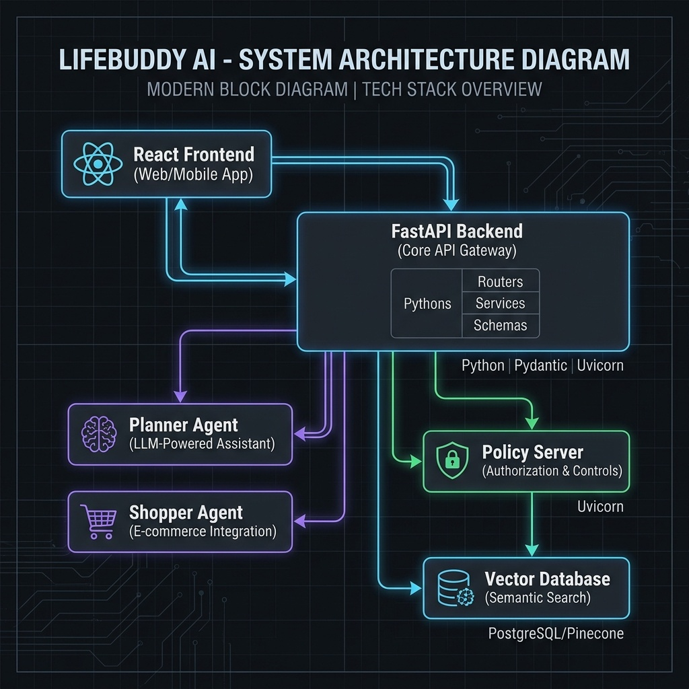
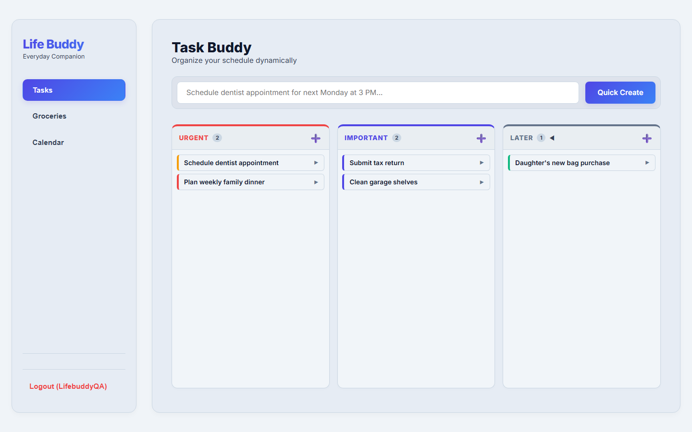
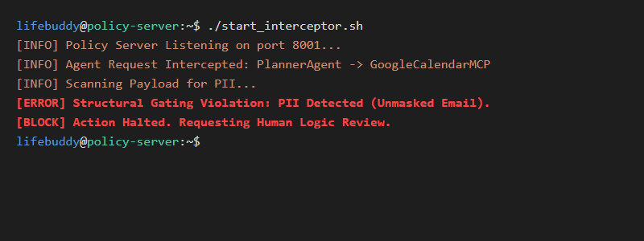

# LifeBuddy: Your AI Concierge

**Vibe Coding Capstone Project - Track: Concierge Agents**
**Authors:** Naveen Kumar Kaluvala and Charitha Miryala

LifeBuddy is an intelligent, multi-agent personal organizer designed to eliminate the cognitive load of daily planning. By leveraging the Agent Development Kit (ADK) and secure execution environments, LifeBuddy acts as your autonomous life concierge.

## 📌 The Problem
Modern professionals suffer from decision fatigue. Balancing urgent work deadlines, scheduling appointments, and remembering mundane household chores (like grocery shopping) leads to burnout. Traditional to-do apps require manual sorting and lack the intelligence to proactively help you manage your time.

## 💡 The Solution
LifeBuddy solves this by utilizing a specialized team of AI Sub-Agents:
1. **The Planner Agent:** Ingests natural language tasks and automatically categorizes them using the **Eisenhower Matrix** (Urgent vs. Important) within the Task Buddy dashboard.
2. **The Shopper Agent:** Analyzes your historical shopping data using **pgvector** semantic similarity to proactively build and categorize your Groceries Buddy list.
3. **The Security Gateway:** A zero-trust Policy Server that intercepts all agent actions. Routine tasks are executed silently via JIT credentials, while high-stakes actions trigger a **Human-in-the-Loop (HITL)** logic review process on the backend.

---

## 🏗 System Architecture

LifeBuddy is built using a modern, agent-centric microservices architecture:

*   **Frontend:** A responsive, glassmorphic React dashboard served directly via the backend.
*   **Backend Routing:** FastAPI serves as the central orchestration hub, managing API routes and routing agent delegations.
*   **Data Layer:** SQLAlchemy ORM managing SQLite/PostgreSQL databases, including vector storage for semantic template matching.
*   **Agent Framework:** Google Agent Development Kit (ADK 2.0) with Model Context Protocol (MCP) integrations for external tools (Gmail/GCal).
*   **Security:** A custom `PolicyChecker` middleware that enforces SPIFFE structural roles and scans payloads to prevent PII leakage.

### Architecture Flow Diagram


---

## 🚀 Setup & Installation

### Prerequisites
*   Python 3.9+
*   Docker (Optional, for isolated deployments)

### Running Locally

1. **Clone the repository**
   ```bash
   git clone https://github.com/yourusername/lifebuddy.git
   cd lifebuddy
   ```

2. **Install dependencies**
   ```bash
   pip install fastapi uvicorn sqlalchemy pyyaml pydantic
   ```
   *(Note: Ensure you have your ADK and MCP dependencies configured as per your local environment).*

3. **Start the API & Dashboard**
   ```bash
   python src/main.py
   ```

4. **Access the Application**
   Open your browser and navigate to: `http://localhost:8000`

### Demo Account
For evaluation purposes, a pre-verified test user is seeded into the database on the first run:
*   **Username:** `LifebuddyQA`
*   **Password:** `Lifebuddydemo`

*(Note: The database is secure. The codebase does not contain plaintext passwords; it only stores pre-computed SHA-256 hashes.)*

---

## 📸 Screenshots

### The Dashboard & Eisenhower Matrix


### Zero-Trust Policy Server


---

## 🛡️ Course Concepts Demonstrated
This capstone submission heavily utilizes concepts taught in the **Intensive Vibe Coding Course**:
*   **Multi-Agent Orchestration:** Using Planner and Shopper specialized agents.
*   **Tool Calling & MCP:** Securely connecting to external services.
*   **Security & Guardrails:** Enforcing logic reviews before taking impactful actions, and utilizing zero-trust policy interceptors to prevent credential leaks.
