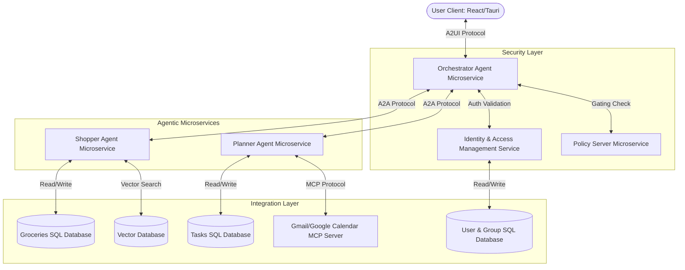
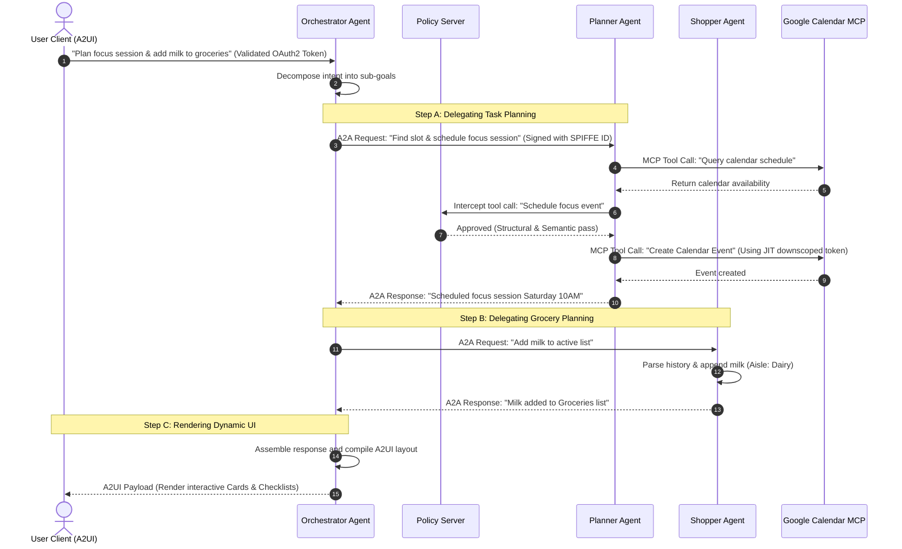

# Life Buddy: Microservices Architecture & Workflow Plan

This document details the microservices-based system architecture and end-to-end workflow for **Life Buddy**, ensuring a scalable, secure, and production-ready implementation.

---

## 1. System Architecture Overview

Rather than building a single monolithic application, Life Buddy is logically partitioned into specialized microservices. This design aligns with the **specialization-as-a-scaling-mechanism** principle, reducing context window sizes and isolating failures.

---

## 2. Microservice Component Breakdown

### 1. Frontend Client (React.js + Tauri)
*   **Role:** The user-facing interface, running as a desktop container wrapper (Tauri) or standard web portal.
*   **Protocol:** Implements the **Agent-to-User Interface (A2UI)** standard. Instead of hardcoding all UI layouts, it renders components dynamically based on the A2UI JSON payload returned by the Orchestrator, rendering interactive cards, choice pickers, and tables natively on the device.

### 2. Orchestrator Agent (FastAPI / Python)
*   **Role:** The cognitive gateway of the system.
*   **Function:** Parses natural language intents, manages the user session, and delegates sub-tasks to specialized microservices over the network. It enforces the **Agent-to-Agent (A2A)** communication protocol.

### 3. Planner Agent (ADK / Python / FastAPI)
*   **Role:** Autonomous scheduling and organization service.
*   **Function:** Exposes endpoints to read, prioritize, and allocate tasks. It has direct access to the Google Calendar MCP server to perform scheduling.
*   **Data Store:** Isolated relational database (SQLite/PostgreSQL) tracking tasks, schedules, and active time-allocations.

### 4. Shopper Agent (ADK / Python / FastAPI)
*   **Role:** Autonomous procurement and grocery intelligence service.
*   **Function:** Exposes endpoints to compile list predictions and group list items by supermarket aisle. Uses long-term vector embeddings to recall past lists and user patterns.
*   **Data Store:** Scoped database partition containing grocery inventories and vector embeddings (via pgvector).

### 5. Gmail/Google Calendar MCP Server (Node.js/Python)
*   **Role:** External integration socket.
*   **Function:** Standardizes Google Workspace read/write operations into a predictable Model Context Protocol (MCP) toolset. Exposes endpoints to search threads, draft emails, and modify calendar events.

### 6. Policy Server (Security Gateway)
*   **Role:** Zero-trust security filter.
*   **Function:** Intercepts all agent actions. Performs **Structural Gating** (verifying tool access rights based on the calling agent's cryptographic signature) and **Semantic Gating** (inspecting natural language payloads for security policy violations or PII leaks).

---

## 3. User Management, IAM & Data Protection

Security in an agent-driven microservices ecosystem requires a layered **defence-in-depth** strategy covering human identity, agent authorization, and data encryption.

### 1. User Identity & Session Management
*   **Authentication (OIDC/OAuth2):** Users authenticate using OpenID Connect (OIDC) through trusted identity providers (such as Google Sign-In) or local credentials.
*   **Password Security:** Local user passwords are hashed using **Argon2id** (the industry-standard key derivation function highly resistant to GPU brute-forcing). Plaintext passwords are never stored.
*   **Group & Role Structure:** 
    *   **Groups (Households):** Users belong to family or organization groups, defining shared boundaries (e.g. sharing the same grocery list or master family calendar).
    *   **Roles:** Admin (can edit groups and grant agent permissions), Editor (can modify tasks/groceries), Viewer (read-only access).

### 2. Identity & Access Management (IAM) for Agents
*   **Agentic Identity:** Each microservice agent is assigned a unique cryptographic identity (via **SPIFFE IDs**). This distinguishes delegated user credentials from native agent actions.
*   **Contextual Authorisation (ABAC):** Access control is governed by Attribute-Based Access Control (ABAC). Permissions are evaluated dynamically against a matrix of **`Intent x User x Time`**:
    *   *Intent:* What task is the agent attempting?
    *   *User:* Which human user authorized the session?
    *   *Time:* The agent only receives Just-In-Time (JIT) tokens that expire as soon as the active request cycle completes.

### 3. Data Protection & Cryptography
*   **Data in Transit:** All microservice-to-microservice communication is strictly encrypted using mutual TLS (**mTLS**), forcing services to cryptographically verify each other's identities before sending payloads.
*   **Data at Rest:** All databases are encrypted using Customer-Managed Encryption Keys (**CMEK**).
*   **Tenant Vector Partitioning:** The Vector Database (storing grocery shopping patterns and user preferences) implements strict tenant partitioning. This prevents **Cross-Tenant Vector Poisoning**, ensuring that search traces from one user session cannot bleed into another.

---

## 4. End-to-End Workflow & Data Flow

Below is the step-by-step workflow when a user requests a complex, multi-turn action: *"Plan my weekend focus session and add milk to my grocery list."*

